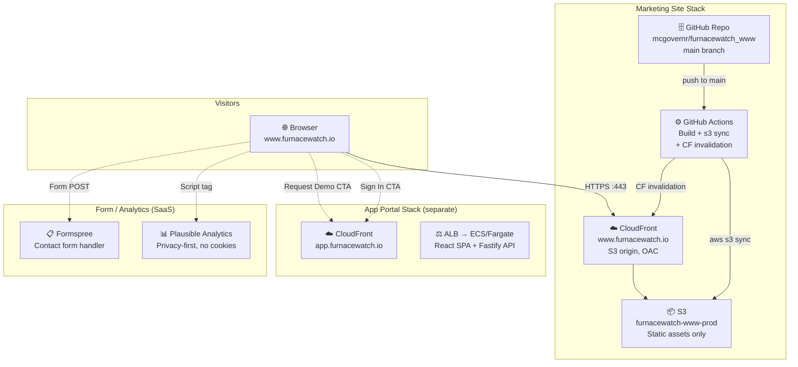
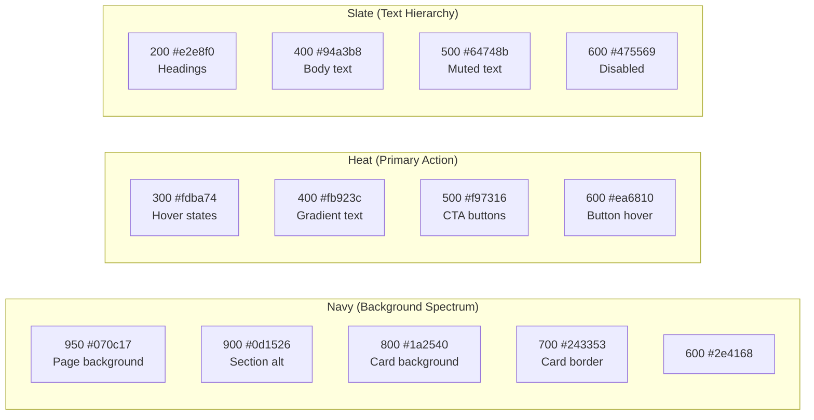

# FurnaceWatch Marketing Site — Build Plan

> **⚠ Superseded in part (2026-08-30):** the site now targets HVAC service companies
> only. `docs/REDESIGN_PLAN.md` governs audience, messaging, page set, and design;
> the Phase 2B/2C page specs and the audience-toggle spec below are historical.
> Infrastructure sections (Phases 1, 3, 4, 5) remain current. Corrections: the site
> ships **Tailwind 3.4** (not 4.0) and emits hashed assets under **`assets/`**
> (not `_astro/`).

**Document**: `docs/BUILD_PLAN.md`  
**Project**: `furnacewatch_www` — `www.furnacewatch.io`  
**Repository**: `https://github.com/mcgovernr/furnacewatch_www`  
**Status**: 🟡 Phase 2A — Core pages complete, Phase 2B in progress  
**Last Updated**: 2026-05-13

---

## TL;DR

Build a **static marketing site** at `www.furnacewatch.io` using **Astro 5 + Tailwind CSS 4**,
deployed to **S3 + CloudFront** via **GitHub Actions**. The site converts HVAC service company
owners and technicians into demo requests. All "Sign In" / "Get Started" CTAs link to the
app portal at `app.furnacewatch.io` — the two sites are deliberately separate deployments.

> The marketing site is the **top of the funnel**. It must be fast, visually compelling, and
> optimized for conversion. It does not share authentication, data, or a build pipeline with
> the app portal.

---

## Phase Registry

| Phase | Name | Status | Gate Criteria |
|-------|------|--------|---------------|
| 1 | Domain & DNS | ✅ Complete | `furnacewatch.io` registered + Route53 zone + ACM cert — all live. S3 buckets and CloudFront deployed. Pending: populate S3 buckets to close verification checks. |
| 2A | Core Pages | ✅ Complete | index, features, pricing, about, contact, 404, blog, docs, customers |
| 2B | Page Depth | 🟡 In progress | All page stubs replaced with full production content |
| 2C | Content | ⬜ Not started | 3+ blog posts, 5+ docs pages, 2+ case studies |
| 3 | CI/CD | ⬜ Not started | GitHub Actions deploys on merge to main |
| 4 | Analytics & Forms | ⬜ Not started | Plausible + Formspree configured, conversion tracking live |
| 5 | Performance & Polish | ⬜ Not started | Lighthouse ≥ 90, CLS < 0.1, custom 404, sitemap, OG images |

---

## Architecture Overview



### Infrastructure Component Summary

| Component | Service | URL / Identifier | Notes |
|-----------|---------|-----------------|-------|
| CDN | AWS CloudFront | `www.furnacewatch.io` | HTTPS, HTTP/2, OAC with S3 |
| Origin | AWS S3 | `furnacewatch-www-prod` | Static files only, no public access |
| CI/CD | GitHub Actions | `.github/workflows/deploy.yml` | OIDC auth (no long-lived keys) |
| DNS | Route53 | `furnacewatch.io` hosted zone | A record → CloudFront distribution |
| TLS | AWS ACM | `*.furnacewatch.io` wildcard | DNS validation, auto-renew |
| Forms | Formspree | `formspree.io/f/<id>` | Handles demo request form |
| Analytics | Plausible | `plausible.io` | Privacy-first, no GDPR cookie banner |
| App Portal | Separate stack | `app.furnacewatch.io` | CloudFront → ALB → ECS (see furnacewatch_app_repo) |

---

## Tech Stack Reference

| Layer | Technology | Version | Notes |
|-------|-----------|---------|-------|
| Site Generator | Astro | 5.7.0 | `output: 'static'` — full pre-render |
| CSS Framework | Tailwind CSS | 4.0.0 | JIT, custom design tokens |
| Markup Extension | MDX | via @astrojs/mdx | Blog posts and docs pages |
| Type Safety | TypeScript | 5.7 | Strict mode, path aliases |
| Content Schema | Astro Content Collections | v5 | Zod-validated, 4 collections |
| Syntax Highlight | Shiki | via Astro | Theme: `night-owl` |
| Site Map | @astrojs/sitemap | latest | Auto-generated at build |
| Build Tool | Vite (via Astro) | 6.x | Rollup, hashed asset filenames |
| Package Manager | npm | 11.x | Node 24.x |
| Runtime | Node.js | 24.14.0 | Build-time only, no server runtime |
| Fonts | Google Fonts CDN | — | Syne (display), Inter (body), JetBrains Mono |
| Hosting | AWS S3 + CloudFront | — | Static files, OAC, no Lambda@Edge needed |
| CI/CD | GitHub Actions | — | OIDC → IAM role, s3 sync + CF invalidation |
| Forms | Formspree | — | `FORMSPREE_FORM_ID` env var |
| Analytics | Plausible | — | `PUBLIC_PLAUSIBLE_DOMAIN` env var |

---

## Repository Structure

```
furnacewatch_www/
├── astro.config.mjs           # Astro build config (integrations, site URL, Vite rollup)
├── tailwind.config.mjs        # Full design system (colors, fonts, spacing, animations)
├── tsconfig.json              # TypeScript strict mode + path aliases
├── package.json               # npm scripts: dev / build / preview / typecheck / lint
├── .env.example               # Documented env var template (committed)
├── .env                       # Actual secrets (gitignored)
├── .gitignore                 # Covers node_modules, dist, .astro, .env, OS files
│
├── .github/
│   └── workflows/
│       └── deploy.yml         # GitHub Actions: build → s3 sync → CF invalidation
│
├── docs/
│   └── BUILD_PLAN.md          # ← this file
│
├── public/                    # Copied verbatim into dist/ at build time
│   ├── favicon.svg            # SVG favicon (flame icon, heat orange)
│   ├── apple-touch-icon.png   # 180×180px
│   ├── site.webmanifest       # PWA manifest: name, icons, theme_color
│   ├── robots.txt             # Disallow: /admin, Sitemap: URL
│   └── images/
│       ├── logo.svg           # FurnaceWatch horizontal lockup (white)
│       ├── logo-dark.svg      # FurnaceWatch horizontal lockup (navy/heat)
│       └── og-default.png     # Default OG image (1200×630)
│
└── src/
    ├── styles/
    │   └── global.css         # Tailwind base/components/utilities + custom layers
    │
    ├── content/               # Astro Content Collections (Zod-validated)
    │   ├── config.ts          # Schema definitions for all 4 collections
    │   ├── blog/              # .mdx files — one file per post
    │   ├── docs/              # .mdx files — one file per doc page
    │   ├── team/              # .json files — one per team member
    │   └── case-studies/      # .mdx files — one per customer story
    │
    ├── layouts/
    │   ├── BaseLayout.astro   # Root HTML shell: meta, OG, fonts, JSON-LD, scroll-reveal
    │   └── PageLayout.astro   # BaseLayout + Header + Footer wrapper
    │
    ├── components/
    │   ├── Header.astro       # Fixed nav, flame logo, mobile hamburger, scroll transparency
    │   ├── Footer.astro       # 5-column grid, brand, nav columns, social, metrics strip
    │   ├── CTASection.astro   # Reusable conversion section (dark / heat variants)
    │   ├── StatBar.astro      # Horizontal metrics strip (gradient-text values)
    │   ├── FeatureCard.astro  # Feature tile (icon, title, description, badge, highlight)
    │   ├── TestimonialCard.astro # Customer quote card (stars, avatar initials)
    │   │
    │   │   ── PHASE 2B additions ──
    │   ├── PricingCard.astro  # Extracted from pricing.astro for reuse
    │   ├── BlogCard.astro     # Blog post card (extracted from blog/index.astro)
    │   ├── DocsSidebar.astro  # Sticky navigation sidebar for docs pages
    │   ├── AlertBadge.astro   # Floating alert demo widget for hero section
    │   └── WaveformViz.astro  # SVG waveform decoration (animated, pure CSS)
    │
    └── pages/
        ├── index.astro        # Landing page (Hero, Stats, Problem/Solution, Features, How It Works, Testimonials, CTA)
        ├── features.astro     # Feature deep-dive page
        ├── pricing.astro      # 3-tier pricing + FAQ
        ├── about.astro        # Company story, values, team
        ├── contact.astro      # Demo request form + sidebar
        ├── customers.astro    # Case studies / social proof
        ├── 404.astro          # Custom 404
        ├── blog/
        │   ├── index.astro    # Blog listing (cards, category filter)
        │   └── [...slug].astro # Individual post template
        ├── docs/
        │   ├── index.astro    # Docs hub (grouped by section)
        │   └── [...slug].astro # Individual doc page + sidebar
        └── legal/
            ├── privacy.astro  # Privacy policy
            └── terms.astro    # Terms of service
```

---

## Design System Specification

### Brand Identity

| Element | Value | Notes |
|---------|-------|-------|
| Brand Name | FurnaceWatch | One word, camelCase |
| Tagline | Know before the furnace fails. | Short. Declarative. |
| Voice | Confident, technical, direct | No fluff. Engineers trust facts. |
| Logo mark | Flame SVG | Inline SVG, gradient fill (heat-400 → heat-600), glow div |
| Logo lockup | FurnaceWatch wordmark + flame | Syne Display typeface |

### Color Palette



| Token | Hex | Usage |
|-------|-----|-------|
| `navy-950` | `#070c17` | Page/hero backgrounds |
| `navy-900` | `#0d1526` | Section alternates |
| `navy-800` | `#1a2540` | Card backgrounds |
| `navy-700` | `#243353` | Card borders, dividers |
| `heat-500` | `#f97316` | Primary CTA, badges, highlights |
| `heat-400` | `#fb923c` | Gradient text end, icons |
| `heat-300` | `#fdba74` | Hover states for heat elements |
| `white` | `#ffffff` | Headings, primary text |
| `slate-300` | `#cbd5e1` | Label text |
| `slate-400` | `#94a3b8` | Body copy |
| `slate-500` | `#64748b` | Muted / secondary text |
| `green-400` | `#4ade80` | Success states, uptime indicators |
| `amber-400` | `#fbbf24` | Warning states |
| `red-400` | `#f87171` | Alert / error states |

### Typography

| Role | Font | Weight | Size Range | Class |
|------|------|--------|-----------|-------|
| Display / Headlines | Syne | 700 (Bold) | 4xl – 9xl | `font-display font-bold` |
| Body | Inter | 400 / 500 | sm – xl | `font-body` (default) |
| Monospace / Code | JetBrains Mono | 400 | xs – base | `font-mono` |
| Section eyebrow | Inter | 600 | xs | `.section-eyebrow` |

**Type Scale (key sizes):**

| Class | Size | Line Height | Usage |
|-------|------|-------------|-------|
| `text-9xl` | 128px | 1.0 | Splash number stats |
| `text-8xl` | 96px | 1.0 | Hero headline (desktop) |
| `text-7xl` | 72px | 1.0 | Hero headline (lg breakpoint) |
| `text-6xl` | 60px | 1.1 | Section titles |
| `text-5xl` | 48px | 1.1 | Page titles |
| `text-4xl` | 36px | 1.2 | Sub-section titles |
| `text-2xl` | 24px | 1.4 | Card headings, subheadlines |
| `text-xl` | 20px | 1.6 | Lead paragraph |
| `text-base` | 16px | 1.6 | Body copy |
| `text-sm` | 14px | 1.5 | Secondary body, labels |
| `text-xs` | 12px | 1.4 | Badges, captions, eyebrows |

### Spacing System

All spacing follows Tailwind's default 4px grid (1 unit = 4px). Key custom spacing:

| Token | Value | Usage |
|-------|-------|-------|
| `space-18` | 72px | Large section padding |
| `space-22` | 88px | Section padding top/bottom |
| `space-30` | 120px | Hero vertical rhythm |
| `space-34` | 136px | Hero padding-bottom buffer |
| `.section` | `py-24 md:py-32` | Standard section vertical rhythm |
| `.section-sm` | `py-16 md:py-24` | Compact sections (hero variants) |
| `.container-fw` | `max-w-7xl mx-auto px-4 sm:px-6 lg:px-8` | Standard content container |

### Motion / Animation

| Token | Duration | Easing | Usage |
|-------|----------|--------|-------|
| `animate-fade-up` | 600ms | ease-out | Scroll reveal on `.reveal` elements |
| `animate-fade-in` | 400ms | ease-out | Fade-only reveal variant |
| `animate-pulse-heat` | 2000ms | ease-in-out | Glow orbs, status indicators |
| `transition-colors` | 150ms | ease | Hover state transitions |
| `transition-transform` | 150ms | ease | Chevron slides, scale effects |

**Scroll Reveal Pattern**: Elements with `.reveal` class start at `opacity-0 translateY(24px)`.
`IntersectionObserver` in `BaseLayout.astro` adds `.visible` class when entering viewport,
which transitions to `opacity-100 translateY(0)`. Delay variants: `.reveal-delay-1` through `.reveal-delay-4`.

### Component Library

| Component | Props | Variants | File |
|-----------|-------|---------|------|
| `.btn` | — | primary / secondary / outline / ghost / sm / lg | `global.css` |
| `.card` | — | default border on navy-800 bg | `global.css` |
| `.card-hover` | — | card + scale-[1.01] + border-navy-600 on hover | `global.css` |
| `.badge` | — | heat / navy / success | `global.css` |
| `.section-eyebrow` | — | uppercase xs with heat-400 dot | `global.css` |
| `.gradient-text` | — | heat-400 → heat-600 bg-clip-text | `global.css` |
| `.prose-fw` | — | custom prose (slate-300 body on navy-950 bg) | `global.css` |
| `.noise-overlay` | — | ::after with subtle noise texture | `global.css` |
| `.glow-line` | — | 1px h border with heat-500 gradient | `global.css` |

---

## Page Specifications

### `/` — Home (index.astro)

**Status**: ✅ Complete (Phase 2A)  
**Priority**: Highest — primary conversion page  
**Goal**: Demo request CTA click or Sign In

#### Section Blueprint

| # | Section | Component Pattern | Key Content |
|---|---------|-------------------|-------------|
| 0 | Audience Toggle | Segmented control (sticky in hero) | "For Homeowners / For HVAC Professionals" — swaps hero + value-prop copy per track (see below) |
| 1 | Hero | Full-height, gradient-hero, noise overlay | H1 swaps by track: Homeowners → "Know the moment your furnace fails — and exactly why." / HVAC Pros → "Know before the furnace fails." Subheadline + 2 CTAs |
| 2 | Stats Bar | StatBar component | 94% accuracy, <2s latency, 99.9% uptime, 6× faster |
| 3 | Problem / Solution | 2-col grid: text + dashboard visual | Problem narrative + floating alert badge demo |
| 4 | Features | 3×2 FeatureCard grid | 6 features: Vibration, ML, Alerts, Fleet, History, RBAC |
| 5 | How It Works | 3-step with connector line | Clip & Power → Learn → Monitor |
| 6 | Testimonials | 3-col TestimonialCard grid | 3 mock customer quotes with ratings |
| 7 | CTA | CTASection (dark variant) | "Request a Demo" primary + "Sign In" secondary |

#### Audience Toggle Behavior

The homepage presents two co-equal tracks behind a **"For Homeowners / For HVAC Professionals"** segmented control (default: HVAC Professionals). The toggle swaps hero headline, subheadline, and the value-prop section copy. The product/capability described is identical — only framing changes. Copy is drawn verbatim from BRAND_COPY.md Section 6 (Track 1 / Track 2).

| Element | For Homeowners | For HVAC Professionals |
|---------|----------------|------------------------|
| H1 | "Know the moment your furnace fails — and exactly why." | "Know before the furnace fails." |
| Value props | Instant failure awareness / Know the cause / Fix the right problem | Fleet health at a glance / Warranty obligation de-risked / Smarter truck rolls |
| Primary CTA | "See it live. Request a demo." | "See it live. Request a demo." |

> **Guardrail:** Homeowner copy stays strictly diagnostic. The "fix the right problem" prop must never imply technicians overcharge — frame as informed homeowner + right-first-time repair only.

#### Phase 2B Improvements

- [ ] Replace dashboard screenshot placeholder with actual screenshot or animated SVG waveform
- [ ] Add logos strip (customer brand logos) between Stats and Problem sections
- [ ] Add FMEA/failure mode interactive diagram in features section
- [ ] Real customer testimonials with photos (once sourced)
- [ ] A/B test hero headline variants
- [ ] Build the For Homeowners / For HVAC Professionals audience toggle (hero + value-prop swap)

#### SEO Targets

| Field | Value |
|-------|-------|
| Title | `FurnaceWatch — Remote Furnace Diagnostics` |
| Description | `Remote diagnostic sensor for gas furnaces. Know the moment a furnace fails — and exactly why — for homeowners and HVAC professionals.` |
| H1 | `Know before the furnace fails.` |
| Primary keyword | `remote furnace diagnostics` |
| Secondary keywords | `furnace failure detection`, `HVAC IoT sensor`, `furnace monitoring`, `furnace failure alert` |
| OG Image | `/images/og-home.png` (1200×630, hero mockup) |

---

### `/features` — Features Deep-Dive (features.astro)

**Status**: 🟡 Stub — Phase 2B priority  
**Goal**: Educate → convert skeptical technical buyers

#### Section Blueprint (Phase 2B Target)

| # | Section | Pattern | Content |
|---|---------|---------|---------|
| 1 | Hero | Text hero | Eyebrow + H1 + subheadline |
| 2 | Vibration Sensing | 2-col: visual left, text right | ADXL355 specs, sampling rate, axis coverage |
| 3 | On-Device ML | 2-col: code snippet + text | TFLite float32, 49 features, inference time |
| 4 | Alert Engine | 2-col: screenshot + text | Multi-channel, FMEA routing, alert fatigue controls |
| 5 | Fleet Map | Full-width visual | Geographic overview, health scoring system |
| 6 | Telemetry History | 2-col: chart + text | IoTDB, 1-second resolution, query window |
| 7 | RBAC | Table: roles + permissions | 7 roles, RLS enforcement, invite flow |
| 8 | API & Integrations | Code snippets | REST API, MQTT, webhook |
| 9 | CTA | CTASection | Demo CTA |

#### Phase 2B Checklist

- [ ] Implement all 9 sections with full copy
- [ ] Add technical specification callout boxes (sampling rate, latency, accuracy numbers)
- [ ] Add comparison table: FurnaceWatch vs. manual inspection vs. other monitoring tools
- [ ] Add "Learn more" anchor links from feature cards on homepage to feature section

---

### `/pricing` — Pricing (pricing.astro)

**Status**: ✅ Substantial (Phase 2A) — needs FAQ  
**Goal**: Reduce pricing objection, route to demo

#### Section Blueprint

| # | Section | Status | Notes |
|---|---------|--------|-------|
| 1 | Hero | ✅ | Eyebrow + headline + subheadline |
| 2 | Pricing cards | ✅ | 3 tiers: Starter / Professional / Enterprise |
| 3 | Annual billing | ✅ | 22% savings callout on each card |
| 4 | FAQ | ⬜ Phase 2B | 8–10 Q&As addressing common objections |
| 5 | CTA | ✅ | CTASection |

#### FAQ Topics (Phase 2B)

1. What's included in the hardware pilot?
2. Do I need internet at each installation site?
3. Can I monitor furnaces I didn't install?
4. What happens if a device goes offline?
5. How is billing calculated for multi-device accounts?
6. Is there a minimum contract term?
7. What's the difference between device health and equipment health scores?
8. Do you support multi-tenant (property management) scenarios?

#### Pricing Tiers

| Plan | Price | Device Limit | Key Differentiators |
|------|-------|-------------|---------------------|
| Starter | $49/device/mo ($39 annual) | 5 | Email + SMS alerts, 30-day history |
| Professional | $89/device/mo ($69 annual) | 50 | FMEA registry, multi-tech routing, API, 1-year history |
| Enterprise | Custom | Unlimited | SSO, custom alerts, SLA, white-label, on-prem |

---

### `/about` — Company (about.astro)

**Status**: ✅ Substantial (Phase 2A) — needs team profiles  
**Goal**: Build trust, convey expertise, humanize the brand

#### Section Blueprint

| # | Section | Status |
|---|---------|--------|
| 1 | Hero | ✅ |
| 2 | Origin story | ✅ (3 paragraphs) |
| 3 | Values grid | ✅ (6 values) |
| 4 | Team profiles | ⬜ Phase 2C |
| 5 | Patent callout | ⬜ Phase 2B |

#### Phase 2B Checklist

- [ ] Add patent mention with link to USPTO (once public)
- [ ] Add "Built on real HVAC data" section — 103+ labeled furnace cycles, 5+ unit models
- [ ] Add press/media kit link when available

---

### `/contact` — Demo Request (contact.astro)

**Status**: ✅ Complete (Phase 2A)  
**Goal**: Form submission → demo scheduled

#### Form Fields

| Field | Type | Required | Validation |
|-------|------|----------|-----------|
| First Name | text | ✅ | Minimum 1 character |
| Last Name | text | ✅ | Minimum 1 character |
| Work Email | email | ✅ | RFC 5322 format |
| Company Name | text | ✅ | Minimum 1 character |
| Fleet Size | select | Optional | 1-10, 11-50, 51-200, 200+ |
| Message | textarea | Optional | No length limit |

#### Form Backend

**Option A (Current)**: Formspree — configure `FORMSPREE_FORM_ID` in `.env`.  
**Option B (Phase 4)**: AWS SES + Lambda → forward to team inbox + Slack notification.

#### Phase 2B Checklist

- [ ] Add `honeypot` hidden field for spam protection
- [ ] Add success/error state UI after form submission (JavaScript)
- [ ] Add Calendly embed as alternative to form (direct scheduling)
- [ ] Configure Formspree account and set FORMSPREE_FORM_ID

---

### `/customers` — Case Studies (customers.astro)

**Status**: ✅ Scaffold complete — no real content yet  
**Goal**: Social proof for mid-funnel prospects

#### Section Blueprint

| # | Section | Status |
|---|---------|--------|
| 1 | Hero | ✅ |
| 2 | Stats strip | ✅ (placeholder stats) |
| 3 | Case study cards | ✅ (empty state fallback) |
| 4 | CTA | ✅ |

#### Content Requirements (Phase 2C)

- Minimum 2 published case studies before page is promoted in nav
- Each case study: company name, industry, location, summary (150–200 words), 2–4 metrics
- Metrics examples: reduction in emergency callbacks, detection accuracy, install time, ROI
- Add case study MDX template with photo support once sourced

---

### `/blog` — Blog Listing & Posts

**Status**: ✅ Structure complete — 1 sample post  
**Goal**: Organic SEO, thought leadership, return visits

#### Collection Schema

```typescript
blog: defineCollection({
  schema: z.object({
    title:       z.string(),
    description: z.string(),
    publishDate: z.date(),
    updatedDate: z.date().optional(),
    author:      z.string().default('FurnaceWatch Team'),
    heroImage:   z.string().optional(),
    heroImageAlt:z.string().optional(),
    category:    z.enum([
      'Product Update', 'Engineering', 'HVAC Industry', 'Case Study', 'Company News'
    ]),
    tags:        z.array(z.string()).default([]),
    featured:    z.boolean().default(false),
    draft:       z.boolean().default(false),
  }),
})
```

#### Content Calendar (Phase 2C — Initial 6 Posts)

| Title | Category | Target Keywords | Status |
|-------|----------|----------------|--------|
| Introducing FurnaceWatch | Company News | furnace monitoring launch | ✅ |
| How On-Device ML Inference Works | Engineering | edge AI HVAC, TFLite ESP32 | ⬜ |
| The 5 Most Common Furnace Failure Modes | HVAC Industry | furnace failure modes, bearing wear | ⬜ |
| Why We Chose Float32 Over INT8 Quantization | Engineering | TFLite quantization, ESP32 ML | ⬜ |
| What 103 Furnace Cycles Taught Us | Engineering | furnace vibration data, HVAC ML | ⬜ |
| How HVAC Companies Use FurnaceWatch | Case Study | HVAC remote monitoring ROI | ⬜ |

#### Blog Post Template Requirements

- Hero image (1200×630 PNG) — store in `public/images/blog/`
- Author bio snippet (pull from team collection)
- Related posts (by category) — Phase 2B
- Social share buttons (Twitter/X, LinkedIn) — Phase 2B
- Estimated read time (auto-calculated from word count) — Phase 2B

---

### `/docs` — Documentation

**Status**: ✅ Structure complete — no real content yet  
**Goal**: Support users, reduce support burden, increase confidence

#### Collection Schema

```typescript
docs: defineCollection({
  schema: z.object({
    title:       z.string(),
    description: z.string(),
    order:       z.number(),
    section:     z.enum([
      'Getting Started', 'Installation', 'Platform Overview', 'Devices & Sensors',
      'Alerts & Notifications', 'Intelligence & ML', 'Integrations', 'API Reference',
      'Administration', 'Troubleshooting'
    ]),
    badge:   z.enum(['New', 'Beta', 'Updated', 'Deprecated']).optional(),
    draft:   z.boolean().default(false),
  }),
})
```

#### Initial Doc Pages (Phase 2C — Priority)

| Section | Title | Priority |
|---------|-------|---------|
| Getting Started | Quick Start Guide | 🔴 High |
| Getting Started | System Requirements | 🔴 High |
| Installation | Physical Installation | 🔴 High |
| Installation | WiFi Setup & Provisioning | 🔴 High |
| Platform Overview | Fleet Map | 🟡 Medium |
| Platform Overview | Health Scoring | 🟡 Medium |
| Devices & Sensors | ADXL355 Sensor Specs | 🟡 Medium |
| Alerts & Notifications | Alert Configuration | 🟡 Medium |
| Intelligence & ML | On-Device Inference | 🟡 Medium |
| Troubleshooting | Device Offline | 🟡 Medium |
| API Reference | Authentication | 🟢 Low |
| API Reference | Telemetry Endpoints | 🟢 Low |

---

### `/404` — Custom 404

**Status**: ✅ Complete (Phase 2A)  
**Content**: "Page not found" + Go Home + Sign In to Portal CTAs

---

### `/legal/privacy` — Privacy Policy

**Status**: ⬜ Not started (Phase 3)  
**Notes**: Required before public launch. Covers: analytics (Plausible), contact form (Formspree), no cookies (Plausible is cookieless).

### `/legal/terms` — Terms of Service

**Status**: ⬜ Not started (Phase 3)

---

## Component Inventory

### `Header.astro`

```typescript
interface Props {
  transparent?: boolean;  // When true: bg-transparent → bg-navy-900 on scroll
}
```

**Behavior**:
- Fixed positioning, `z-50`
- Desktop: flex nav with 5 links (Features, Pricing, Customers, Blog, Docs), Sign In ghost, Request Demo primary
- Mobile: hamburger button reveals slide-down menu
- Scroll threshold at 60px: adds `backdrop-blur-sm bg-navy-900/95` + `border-b border-navy-800`
- Active state: `text-heat-400` for current page (detected via `Astro.url.pathname`)
- Logo: inline SVG flame (no external request), gradient fill, `.flame-glow` div

**Dependencies**: `PUBLIC_APP_URL` env var for Sign In link

---

### `Footer.astro`

```typescript
// No props — uses env vars internally
```

**Layout**: 5-column grid (`grid-cols-2 lg:grid-cols-5`)
- Col 1–2: Brand (flame logo, tagline, metrics strip, LinkedIn link)
- Col 3: Product links (Features, Pricing, Customers, Request Demo)
- Col 4: Resources links (Blog, Docs, API Reference, Changelog)
- Col 5: Company links (About, Contact, Privacy, Terms)

**Bottom bar**: `© {year} FurnaceWatch · Built for HVAC professionals.`

---

### `CTASection.astro`

```typescript
interface Props {
  title?: string;           // Default: "Ready to stop reacting and start predicting?"
  subtitle?: string;        // Default: "Schedule a 30-minute demo..."
  primaryLabel?: string;    // Default: "Request a Demo"
  primaryHref?: string;     // Default: "/contact"
  secondaryLabel?: string;  // Default: "Sign In to Portal"
  secondaryHref?: string;   // Default: "{appUrl}/login"
  variant?: 'dark' | 'heat'; // Default: "dark"
}
```

---

### `StatBar.astro`

```typescript
interface Stat {
  value: string;    // e.g., "94", "<2", "99.9"
  suffix?: string;  // e.g., "%", "s"
  label: string;    // e.g., "Detection accuracy"
}

interface Props {
  stats: Stat[];
  variant?: 'dark' | 'border'; // Default: "dark"
}
```

**Layout**: Dynamic `grid-cols-{N}` based on `stats.length`. Values use `.gradient-text`.

---

### `FeatureCard.astro`

```typescript
interface Props {
  icon: string;          // SVG path `d` attribute string (Heroicons)
  title: string;
  description: string;
  badge?: string;        // Optional — renders as badge-heat
  highlighted?: boolean; // When true: border-heat-500/30 + bg-heat-500/5
}
```

---

### `TestimonialCard.astro`

```typescript
interface Props {
  quote: string;
  name: string;
  title: string;
  company: string;
  avatarInitials?: string; // Auto-generated from name if omitted
  rating?: number;          // 1–5 stars, default: 5
}
```

---

## Interface Contracts

### www.furnacewatch.io ↔ app.furnacewatch.io

The marketing site and app portal are **separate deployments**. Their contract is minimal:

| Contract | Direction | Artifact |
|----------|-----------|---------|
| App portal URL | Config → www site | `PUBLIC_APP_URL` env var (`https://app.furnacewatch.io`) |
| Sign In URL | www → app | `${appUrl}/login` |
| Demo account signup | www → app | `${appUrl}/signup` (future) |
| OG domain | Both | `www.furnacewatch.io` for marketing, `app.furnacewatch.io` for portal |

> **Rule**: The marketing site NEVER imports from the app repo, shares a build process, or mounts API routes. They are permanently independent.

### Contact Form ↔ Formspree

| Field | Value |
|-------|-------|
| Endpoint | `https://formspree.io/f/${FORMSPREE_FORM_ID}` |
| Method | `POST` |
| Content-Type | `application/x-www-form-urlencoded` (browser native form) |
| Fields | `firstName`, `lastName`, `email`, `company`, `fleetSize`, `message` |
| Response | Formspree redirect or AJAX JSON |
| Spam protection | `_gotcha` honeypot field (Phase 2B) |

### GitHub Actions ↔ AWS

| Contract | Value |
|----------|-------|
| Auth method | OIDC (no long-lived keys) |
| IAM role name | `furnacewatch-www-github-deploy` |
| S3 bucket | `furnacewatch-www-prod` |
| S3 sync command | `aws s3 sync ./dist/ s3://furnacewatch-www-prod/ --delete --cache-control "max-age=31536000,immutable"` |
| HTML files | `--cache-control "max-age=0,no-cache"` (separate pass for `*.html`) |
| CF invalidation | `aws cloudfront create-invalidation --distribution-id <ID> --paths "/*"` |
| Trigger | `push` to `main` branch |

---

## SEO Strategy

### Meta Tag Contract

Every page must have:

| Tag | Source | Example |
|-----|--------|---------|
| `<title>` | `PageLayout` title prop | `Pricing — FurnaceWatch` |
| `<meta name="description">` | `PageLayout` description prop | Max 160 chars |
| `<link rel="canonical">` | `BaseLayout` canonical prop or `Astro.url.href` | Absolute URL |
| `<meta property="og:title">` | title | Same as `<title>` |
| `<meta property="og:description">` | description | Same as meta description |
| `<meta property="og:image">` | ogImage prop or default | `PUBLIC_SITE_URL/images/og-default.png` |
| `<meta property="og:type">` | ogType prop | `website` or `article` |
| `<meta name="twitter:card">` | BaseLayout | `summary_large_image` |

### JSON-LD Schema

- `Organization` schema on every page (in BaseLayout) — name, url, logo, contactPoint
- `Article` schema on blog post pages (in `blog/[...slug].astro`)
- `FAQPage` schema on pricing page FAQ (Phase 2B)
- `BreadcrumbList` on docs pages (Phase 2B)

### Sitemap

Auto-generated by `@astrojs/sitemap` at build time. Configure in `astro.config.mjs`:
```js
sitemap({
  filter: (page) => !page.includes('/admin') && !page.includes('/legal'),
})
```

### `robots.txt` (in `public/`)

```
User-agent: *
Allow: /

Disallow: /admin/
Disallow: /_astro/

Sitemap: https://www.furnacewatch.io/sitemap-index.xml
```

### Lighthouse Targets

| Metric | Target | Acceptable |
|--------|--------|------------|
| Performance | ≥ 90 | ≥ 85 |
| Accessibility | ≥ 95 | ≥ 90 |
| Best Practices | ≥ 90 | ≥ 85 |
| SEO | ≥ 95 | ≥ 90 |

### Core Web Vitals Targets

| CWV | Target | Notes |
|-----|--------|-------|
| LCP (Largest Contentful Paint) | < 2.5s | Preload hero image/SVG |
| INP (Interaction to Next Paint) | < 200ms | Minimal JavaScript |
| CLS (Cumulative Layout Shift) | < 0.1 | Specify image dimensions, no font-swap flash |

### Performance Rules

1. **No JavaScript for rendering** — Astro ships zero JS by default; only `client:*` directives add JS
2. **No runtime JS** except: scroll listener (Header), IntersectionObserver (reveal), mobile menu toggle
3. **Google Fonts**: preconnect links + `&display=swap` — no CLS penalty
4. **Images**: Always specify `width` + `height` attributes. Use `loading="lazy"` on below-fold images
5. **SVGs**: Inline critical SVGs (logo, icons) to avoid extra HTTP requests
6. **Hashed assets**: Rollup configured with `[name].[hash][extname]` for immutable caching
7. **HTML cache**: `Cache-Control: max-age=0, no-cache` on `.html` files — always fresh
8. **Asset cache**: `Cache-Control: max-age=31536000, immutable` on all hashed assets

---

## Analytics & Monitoring Plan

### Plausible (Phase 4)

**Why Plausible over GA4**: No cookies, no GDPR consent banner, no personal data collection.
GDPR/CCPA compliant out of the box.

```html
<!-- BaseLayout.astro — conditionally included -->
{plausibleDomain && (
  <script
    defer
    data-domain={plausibleDomain}
    src="https://plausible.io/js/script.js"
  />
)}
```

**Goals to track**:
- `Request Demo` button click (Contact page form submission)
- `Sign In to Portal` click
- `Blog post` views by category
- `Docs` page views by section
- Pricing page visit → Contact page (funnel)

### Error Monitoring (Phase 5)

Consider Sentry browser SDK (lightweight) for JS error tracking.
Given minimal JS, this is low priority.

### Uptime Monitoring (Phase 5)

Use AWS CloudWatch alarms on CloudFront 5xx error rate.
Alert threshold: >1% 5xx errors over 5-minute window.

---

## Deployment Pipeline

### Environment Variables

| Variable | Required | Used By | Source |
|----------|----------|---------|--------|
| `SITE_URL` | Build | `astro.config.mjs` → `site:` | GitHub Actions env |
| `PUBLIC_APP_URL` | Build + Runtime | Header, Footer, CTAs, 404 | GitHub Actions env |
| `FORMSPREE_FORM_ID` | Build | `contact.astro` form action | GitHub Secrets |
| `PUBLIC_PLAUSIBLE_DOMAIN` | Build | `BaseLayout.astro` script | GitHub Actions env |
| `PUBLIC_GA4_ID` | Build | Optional GA4 fallback | GitHub Actions env |
| `PUBLIC_TWITTER_HANDLE` | Build | `BaseLayout.astro` OG meta | GitHub Actions env |
| `PUBLIC_LINKEDIN_URL` | Build | `Footer.astro` | GitHub Actions env |
| `PUBLIC_SHOW_BLOG` | Build | Feature flag | GitHub Actions env |
| `PUBLIC_SHOW_DOCS` | Build | Feature flag | GitHub Actions env |

### GitHub Actions Workflow (`.github/workflows/deploy.yml`)

```yaml
name: Deploy to S3 + CloudFront

on:
  push:
    branches: [main]

permissions:
  id-token: write   # Required for OIDC
  contents: read

env:
  AWS_REGION: us-east-1
  S3_BUCKET: furnacewatch-www-prod
  CF_DISTRIBUTION_ID: ${{ secrets.CF_DISTRIBUTION_ID }}

jobs:
  deploy:
    runs-on: ubuntu-latest
    steps:
      - uses: actions/checkout@v4

      - uses: actions/setup-node@v4
        with:
          node-version: '24'
          cache: 'npm'

      - name: Install dependencies
        run: npm ci

      - name: Build site
        run: npm run build
        env:
          SITE_URL: https://www.furnacewatch.io
          PUBLIC_APP_URL: https://app.furnacewatch.io
          FORMSPREE_FORM_ID: ${{ secrets.FORMSPREE_FORM_ID }}
          PUBLIC_PLAUSIBLE_DOMAIN: www.furnacewatch.io
          PUBLIC_SHOW_BLOG: 'true'
          PUBLIC_SHOW_DOCS: 'true'

      - name: Configure AWS credentials (OIDC)
        uses: aws-actions/configure-aws-credentials@v4
        with:
          role-to-assume: arn:aws:iam::331411055902:role/furnacewatch-www-github-deploy
          aws-region: ${{ env.AWS_REGION }}

      - name: Sync HTML files (no-cache)
        run: |
          aws s3 sync ./dist/ s3://${{ env.S3_BUCKET }}/ \
            --exclude "*" --include "*.html" \
            --cache-control "max-age=0,no-cache" \
            --delete

      - name: Sync assets (immutable cache)
        run: |
          aws s3 sync ./dist/ s3://${{ env.S3_BUCKET }}/ \
            --exclude "*.html" \
            --cache-control "max-age=31536000,immutable"

      - name: Invalidate CloudFront
        run: |
          aws cloudfront create-invalidation \
            --distribution-id ${{ env.CF_DISTRIBUTION_ID }} \
            --paths "/*.html" "/sitemap*.xml" "/robots.txt"
```

### IAM Role Policy for OIDC (Phase 3 — Infra Setup)

```json
{
  "Statement": [
    {
      "Effect": "Allow",
      "Action": ["s3:PutObject", "s3:GetObject", "s3:DeleteObject", "s3:ListBucket"],
      "Resource": [
        "arn:aws:s3:::furnacewatch-www-prod",
        "arn:aws:s3:::furnacewatch-www-prod/*"
      ]
    },
    {
      "Effect": "Allow",
      "Action": ["cloudfront:CreateInvalidation"],
      "Resource": "arn:aws:cloudfront::331411055902:distribution/*"
    }
  ]
}
```

### OIDC Trust Relationship

```json
{
  "Version": "2012-10-17",
  "Statement": [{
    "Effect": "Allow",
    "Principal": {
      "Federated": "arn:aws:iam::331411055902:oidc-provider/token.actions.githubusercontent.com"
    },
    "Action": "sts:AssumeRoleWithWebIdentity",
    "Condition": {
      "StringEquals": {
        "token.actions.githubusercontent.com:aud": "sts.amazonaws.com"
      },
      "StringLike": {
        "token.actions.githubusercontent.com:sub": "repo:mcgovernr/furnacewatch_www:ref:refs/heads/main"
      }
    }
  }]
}
```

---

## Phase-Gated Build Plan

### Phase 1 — Domain & DNS

**Owner**: Infrastructure (manual steps)  
**Blockers**: None  
**Gate**: DNS resolves `www.furnacewatch.io` and `app.furnacewatch.io` → CloudFront

```
[x] Register furnacewatch.io at Namecheap/Cloudflare/Route53 Registrar — registered, hosted in Route53
[x] Create Route53 hosted zone: furnacewatch.io — zone ID Z00070631KI10DBSL0A43
[x] Update nameservers at registrar → Route53 NS records — ns-116, ns-649, ns-1071, ns-1789
[x] Request ACM wildcard certificate: *.furnacewatch.io (DNS validation) — deployed in us-east-1
[x] Wait for ACM validation (usually <30 min via Route53 auto-validation) — ISSUED
[x] Create S3 bucket: furnacewatch-www-prod (no public access) — bucket: furnacewatch-www-331411055902
[x] Create CloudFront distribution (www.furnacewatch.io → S3, OAC, HTTPS only) — WwwCdn: d2eqcfnwjvlqtd.cloudfront.net
[x] Create Route53 A record (alias): www.furnacewatch.io → CloudFront — live
[x] Re-enable CloudFront for app in furnacewatch_app_repo/infra (currently commented out) — AppCdn: d58rzmuafatky.cloudfront.net
[x] Create Route53 A record (alias): app.furnacewatch.io → app CloudFront — live
[ ] Verify: https://www.furnacewatch.io/ returns 200 with Astro site — deployed 2026-05-14, CloudFront invalidation in progress (ID: IA0QXPL817M58NGCH0FFM2E2FS)
[ ] Verify: https://app.furnacewatch.io/ returns 200 with React SPA — blocked: React SPA not yet synced to WebBucket
```

---

### Phase 2A — Core Pages ✅ COMPLETE

All pages scaffolded: index, features, pricing, about, contact, customers, blog (index + slug), docs (index + slug), 404.

---

### Phase 2B — Page Depth

**Goal**: Replace all stubs with production-quality content  
**Target completion**: Before first beta user outreach

```
[ ] features.astro — implement all 9 feature sections with full copy
[ ] pricing.astro — implement FAQ section (8–10 Q&As)
[ ] about.astro — add patent callout section
[ ] index.astro — add customer logo strip between Stats and Problem sections
[ ] index.astro — replace dashboard screenshot placeholder with real screenshot or animated SVG
[ ] All pages — add estimated read time to blog post cards
[ ] All pages — add related posts widget on blog post pages
[ ] components/ — extract PricingCard, BlogCard, DocsSidebar as reusable components
[ ] Add AlertBadge.astro — animated floating alert demo widget
[ ] Add WaveformViz.astro — animated SVG waveform for hero visual
```

---

### Phase 2C — Content

**Goal**: Enough real content to index in search and demonstrate thought leadership  
**Minimum viable**: 3 blog posts + 5 docs pages + 2 case studies

```
Blog posts:
[ ] "How On-Device ML Inference Works on ESP32" (Engineering)
[ ] "The 5 Most Common Furnace Failure Modes" (HVAC Industry)
[ ] "What 103 Furnace Cycles Taught Us" (Engineering)

Docs pages:
[ ] Getting Started / Quick Start Guide
[ ] Getting Started / System Requirements
[ ] Installation / Physical Installation
[ ] Installation / WiFi Setup & Provisioning
[ ] Troubleshooting / Device Offline

Case studies:
[ ] 2 customer case studies (coordinate with first beta users)

Team:
[ ] Team profiles in src/content/team/
```

---

### Phase 3 — CI/CD

```
[ ] Create GitHub repository: mcgovernr/furnacewatch_www
[ ] git init + initial commit + push to main
[ ] Create IAM OIDC provider in AWS account 331411055902
[ ] Create IAM role: furnacewatch-www-github-deploy (see policy above)
[ ] Create .github/workflows/deploy.yml (see spec above)
[ ] Add GitHub Secrets: CF_DISTRIBUTION_ID, FORMSPREE_FORM_ID
[ ] Test: push to main → verify Actions run → verify site updates at www.furnacewatch.io
[ ] Add branch protection on main: require status check (deploy job) to pass
```

---

### Phase 4 — Analytics & Forms

```
[ ] Create Formspree account → create new form → copy form ID
[ ] Set FORMSPREE_FORM_ID in GitHub Secrets
[ ] Test contact form submission → verify email received
[ ] Add honeypot field to contact form (_gotcha)
[ ] Create Plausible account → add domain → copy script
[ ] Set PUBLIC_PLAUSIBLE_DOMAIN in GitHub Actions env
[ ] Verify Plausible tracking with Real-Time dashboard
[ ] Set up Plausible goals: demo_request, sign_in_click
[ ] Add success/error state handling to contact form (JavaScript)
```

---

### Phase 5 — Performance & Polish

```
Performance:
[ ] Run Lighthouse on all pages → fix any issues below threshold
[ ] Verify Core Web Vitals pass in PageSpeed Insights
[ ] Add resource hints: <link rel="preload"> for hero image/SVG
[ ] Add <link rel="preconnect"> for Google Fonts (already in BaseLayout)
[ ] Audit JavaScript bundle — should be < 10KB total for marketing site

Assets:
[ ] Create favicon.svg (flame icon, heat-500)
[ ] Create apple-touch-icon.png (180×180)
[ ] Create site.webmanifest
[ ] Create og-default.png (1200×630, branded default OG image)
[ ] Create og-home.png (1200×630, hero mockup)
[ ] Create logo.svg (horizontal lockup, white)

Legal:
[ ] Write privacy.astro (covers Plausible, Formspree)
[ ] Write terms.astro
[ ] Update Footer links to point to /legal/privacy and /legal/terms

Accessibility:
[ ] Audit color contrast ratios (heat-400 on navy-950 must be ≥ 4.5:1)
[ ] Verify keyboard navigation works on all interactive elements
[ ] Test screen reader experience with NVDA or VoiceOver
[ ] Verify skip-to-content link works (already in BaseLayout)

Launch checklist:
[ ] DNS resolves correctly from external network
[ ] HTTPS redirects HTTP automatically
[ ] www. redirects non-www (CloudFront behavior)
[ ] Sitemap returns 200 at /sitemap-index.xml
[ ] robots.txt returns 200
[ ] OG image appears correctly in Twitter Card Validator
[ ] OG image appears correctly in LinkedIn Post Inspector
[ ] Google Search Console — submit sitemap
[ ] All internal links work (no broken hrefs)
[ ] All external links open in new tab with rel="noopener"
[ ] Form submission works end-to-end
[ ] Mobile viewport renders correctly at 375px, 390px, 430px
```

---

## Development Workflow

### Local Development

```powershell
# From C:\furnacewatch_www\
npm install          # First time only
npm run dev          # Start dev server → http://localhost:4321/

# Type checking
npm run typecheck    # astro check

# Production build test
npm run build        # Outputs to dist/
npm run preview      # Serve dist/ at http://localhost:4321/
```

### Adding a Blog Post

1. Create `src/content/blog/my-post-slug.mdx`
2. Copy frontmatter from `introducing-furnacewatch.mdx`
3. Write content in MDX (Markdown + Astro components)
4. Set `draft: false` when ready
5. Commit and push — CI/CD deploys automatically

### Adding a Docs Page

1. Create `src/content/docs/section-name/my-page.mdx`
2. Set `section` to one of the 10 defined sections
3. Set `order` for sidebar sort position
4. Set `draft: false` when ready

### Changing the Design System

All design tokens live in `tailwind.config.mjs`. Changes there cascade across all components.
After changing, run `npm run dev` and verify the change looks correct on the homepage.

---

## Known Decisions & Rationale

| Decision | Rationale |
|----------|-----------|
| Astro over Next.js | Static output only. Zero server runtime cost. Ships zero JS by default. MDX content collections. |
| Tailwind 4 (not 3) | New `@theme` CSS variables, faster JIT, first-class CSS-in-CSS (no JS config required in future) |
| Separate repo from app | Marketing site and app portal have different deploy targets, different tech stacks, different cadences. Shared repo creates coupling without benefit. |
| Plausible over GA4 | No cookies, no consent banner, no PII. GDPR compliant. Good enough for conversion funnel metrics. |
| Formspree over SES | Lower infrastructure complexity for phase 1. No AWS Lambda, no email deliverability config. Migrate to SES if volume requires. |
| Float32 TFLite (not INT8) | INT8 quantization clips output range to ≤ 0.5, producing useless probability scores. Float32 gives correct full-range sigmoid. 26KB model fits in ESP32 PSRAM. |
| S3 + CloudFront (not Vercel/Netlify) | Consistent with existing AWS footprint (account 331411055902). Avoids vendor lock-in to hosting SaaS. OIDC auth eliminates long-lived deploy keys. |

---

## Appendix A: Environment Variables Reference

```bash
# .env.example
# Copy to .env and fill in values before running locally.

# ── Build ──────────────────────────────────────────────
SITE_URL=https://www.furnacewatch.io

# ── Public (inlined at build time via import.meta.env) ─
PUBLIC_APP_URL=https://app.furnacewatch.io
PUBLIC_PLAUSIBLE_DOMAIN=www.furnacewatch.io
PUBLIC_GA4_ID=                         # Optional, leave blank if using Plausible
PUBLIC_TWITTER_HANDLE=@furnacewatch
PUBLIC_LINKEDIN_URL=https://linkedin.com/company/furnacewatch
PUBLIC_SHOW_BLOG=true                  # Feature flag — hide blog until content is ready
PUBLIC_SHOW_DOCS=true                  # Feature flag — hide docs until content is ready

# ── Private (server-side / build-only) ─────────────────
FORMSPREE_FORM_ID=                     # Get from formspree.io after creating form
SES_ENDPOINT=                          # Future: AWS SES endpoint for direct email
```

---

## Appendix B: Astro Config Reference

```js
// astro.config.mjs — key settings
export default defineConfig({
  site:   'https://www.furnacewatch.io',
  output: 'static',              // Full pre-render — no server required
  integrations: [
    tailwind({ applyBaseStyles: false }),  // We manage @tailwind directives in global.css
    mdx({ shikiConfig: { theme: 'night-owl' } }),
    sitemap({ filter: (p) => !p.includes('/admin') }),
  ],
  vite: {
    build: {
      rollupOptions: {
        output: {
          assetFileNames: '_astro/[name].[hash][extname]', // Cache-busting hashes
          chunkFileNames: '_astro/[name].[hash].js',
          entryFileNames: '_astro/[name].[hash].js',
        },
      },
    },
  },
});
```

---

## Appendix C: Content Collection Schema Reference

```typescript
// src/content/config.ts

blog: defineCollection({
  schema: z.object({
    title:        z.string(),
    description:  z.string(),
    publishDate:  z.date(),
    updatedDate:  z.date().optional(),
    author:       z.string().default('FurnaceWatch Team'),
    heroImage:    z.string().optional(),
    heroImageAlt: z.string().optional(),
    category:     z.enum(['Product Update','Engineering','HVAC Industry','Case Study','Company News']),
    tags:         z.array(z.string()).default([]),
    featured:     z.boolean().default(false),
    draft:        z.boolean().default(false),
  }),
});

docs: defineCollection({
  schema: z.object({
    title:       z.string(),
    description: z.string(),
    order:       z.number(),
    section:     z.enum(['Getting Started','Installation','Platform Overview','Devices & Sensors',
                         'Alerts & Notifications','Intelligence & ML','Integrations',
                         'API Reference','Administration','Troubleshooting']),
    badge:       z.enum(['New','Beta','Updated','Deprecated']).optional(),
    draft:       z.boolean().default(false),
  }),
});

team: defineCollection({
  type: 'data',
  schema: z.object({
    name:     z.string(),
    title:    z.string(),
    bio:      z.string(),
    image:    z.string().optional(),
    linkedin: z.string().optional(),
    twitter:  z.string().optional(),
    order:    z.number().default(99),
  }),
});

caseStudies: defineCollection({
  schema: z.object({
    company:     z.string(),
    industry:    z.string(),
    location:    z.string(),
    logos:       z.array(z.string()).default([]),
    summary:     z.string(),
    metrics:     z.array(z.object({ value: z.string(), label: z.string() })).default([]),
    publishDate: z.date(),
    featured:    z.boolean().default(false),
    draft:       z.boolean().default(false),
  }),
});
```

---

*This document is the single source of truth for the `furnacewatch_www` marketing site build.
Update this file as decisions are made and phases complete.*
